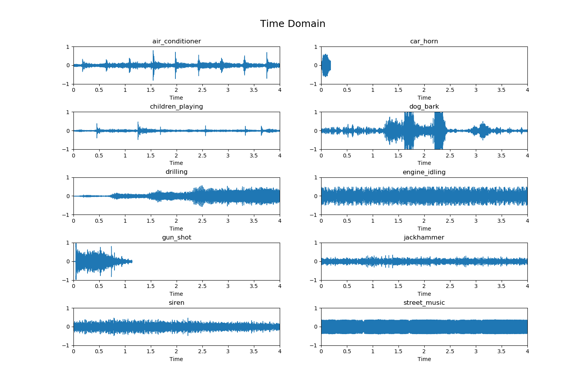

# Urban Sound Classification
This repository is for my first Kaggle challenge. The link to the original dataset can be found [here](https://www.kaggle.com/papeloto/urban-sound-feature-extraction-knn). The dataset has more than 8000 classified sound-bites or urban sounds. There are 10 different classifications:

1. Air conditioner
1. Car horn
1. Children playing
1. Dog bark
1. Drilling
1. Engine idling
1. Gun shot
1. Jackhammer
1. Siren
1. Street music

My goal is to use signal processing and machine learning techniques to create a model that can accurately classify these sounds.

## Visualization
The first step in creating a good classifier for our data is to get a good idea of what the data looks like in the first place. Viewing these depictions will help determine which features will be useful in classification. For each classification type we will observe:
1. Time Domain
1. Frequency Domain
1. Spectrogram

### Time Domain
Wave files store the audio data as a series of audio samples at a given frequency. Thus, graphing the Time Domain (time v. amplitude) is quite straight forward. The x-axis limits were set to (0,4) and y-axis to (-1,1) so that each graph would retain the same scale.

  

### Frequency Domain
By taking the Fast Fourier Transform of the samples, we can get the frequency domain. The frequency domain contains information on how much of each frequency band is present in our audio sample. The result of the FFT is complex but since we don't care about phase information we just take the absolute value to get the magnitude of each frequency band. All magnitudes are divided by the total number of samples in the audio in order to normalize them. Since these are real valued signals, we only take the first half of the spectrum. Finally, due to the Nyquist condition, the frequency range will be from 0 Hz to half of the sample rate.

  

### Spectrogram
Finally, we will look at spectrograms of each classification. A spectrogram calculates the Fourier Transform over small snippets of the audio sample. The Fourier Transforms give us the magnitude (in this case converted to dB) with respect to frequency, but since they are taken over small time windows we also retain some time based information. Thus, we end up with a chart that shows us three different variables: frequency, magnitude, *and* time.

  

