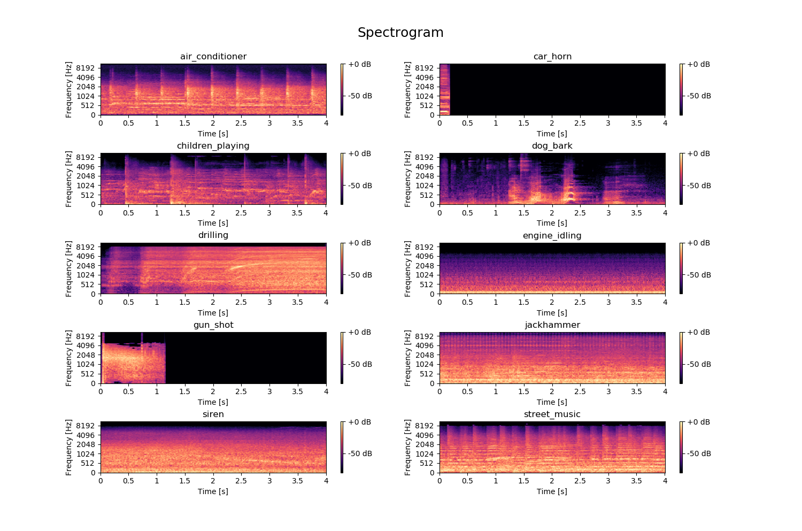
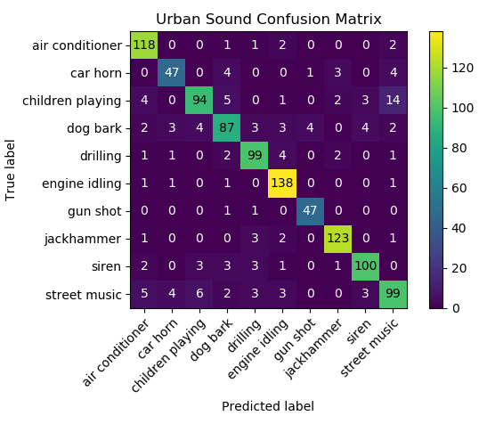

# Urban Sound Classification
This repository is for my first Kaggle challenge. The original dataset has more than 8000 classified sound-bites of urban sounds. There are 10 different classifications:

1. Air conditioner
1. Car horn
1. Children playing
1. Dog bark
1. Drilling
1. Engine idling
1. Gun shot
1. Jackhammer
1. Siren
1. Street music

My goal is to use signal processing and machine learning techniques to create a model that can accurately classify these sounds.

If you would like to experiment with the model, clone this project, download the data and run:
```bash
C:/.../urban-sound-classification> classifier.py -h
```
This will show you a list of all configurable options on running the model. For example, you can tweak parameters of the model such as learning rate, kernel size, dropout, epochs, color mode, whether or not to add noise, and much more.

## Visualization
The first step in creating a good classifier for our data is to get a thorough idea of what the data looks like in the first place. Viewing these depictions will help determine which features will be useful in classification. For each classification type we will observe:
1. Time Domain
1. Frequency Domain
1. Spectrogram

### Time Domain
Wave files store the audio data as a series of audio samples at a given sample rate. Thus, graphing the Time Domain (time v. amplitude) is quite straight forward--we're essentially just graphing the .wav file itself. The x-axis limits were set to (0,4) since each .wav file in our dataset was between 0 and 4 seconds long and the y-axis limited to (-1,1) so that each graph would retain the same scale.
<p align="center">
  
</p>

### Frequency Domain
By taking the Fourier Transform of the samples, we can get the frequency domain. The frequency domain contains information on how much of each frequency band is present in our audio sample. The result of the FFT is complex but since we don't care about phase information we just take the absolute value to get the magnitude of each frequency band. All magnitudes are divided by the total number of samples in the audio in order to normalize them. Due to the Nyquist condition, the frequency range will be from 0 Hz to half of the sample rate.
<p align="center">
  
</p>

### Spectrogram
Finally, we will look at spectrograms of each classification. A spectrogram calculates the Fourier Transform over small snippets of the audio clip, as opposed to the entire clip. The Fourier Transforms give us the magnitude (in this case converted to dB) with respect to frequency, but since they are taken over small time windows we also retain some time based information. Thus, we end up with a chart that shows us three different variables: frequency, magnitude, *and* time. All clips were normalized to four seconds long in order to retain the same scale. In addition, instead of doing a linear frequency axis the [mel scale](https://en.wikipedia.org/wiki/Mel_scale) was used to better represent human hearing.
<p align="center">
  
</p>

### Data Summary
After viewing the data in multiple different forms, it is clear that the spectrogram conveys the most information. The time and frequency domains are powerful and valuable representations, but they each only show two dimensions of a three dimensional problem. The spectrogram, on the other hand, has all three dimensions: time, frequency, and magnitude. Ultimately, spectrograms convey the densest representation of our data.

## Machine Learning Model
Since spectrogram images are such a good representation of our images, we will be using them as inputs to a convolutional neural network--a machine learning configuration that is notoriously good at classifying images. Unlike typical neural networks that have input vectors, the input to our neural network will be a matrix of pixels (an image). Simply put, each neuron in a convolution layer has a kernel slide over this matrix and preforms a convolution operation. The goal is to find kernels that detect features in the image. For an in depth explanation of convolutional neural networks, check out [this](https://www.youtube.com/watch?v=py5byOOHZM8) YouTube video and/or [this](https://medium.com/technologymadeeasy/the-best-explanation-of-convolutional-neural-networks-on-the-internet-fbb8b1ad5df8) Medium article.

<p align="center">
  
</p>

After much experimentation, I found that a good convolution network configuration for spectrogram classification can be structured as so:
```python
model = keras.Sequential()
model.add(Conv2D(16, kernel_size=(6,6), activation='relu', input_shape=(77,77)))
model.add(MaxPooling2D(pool_size=(2,2)))
model.add(Dropout(.2))
model.add(Conv2D(32, kernel_size=(6,6), activation='relu'))
model.add(MaxPooling2D(pool_size=(2,2)))
model.add(Dropout(.5))
model.add(Conv2D(64, kernel_size=kernel_size, activation='relu'))
model.add(MaxPooling2D(pool_size=pool_size))
model.add(Dropout(.5))
model.add(Flatten())
model.add(Dense(64, activation='relu'))
model.add(Dense(128, activation='relu'))
model.add(Dense(10, activation='softmax'))
optimizer = SGD(lr=.001)
model.compile(optimizer=optimizer, loss='categorical_crossentropy', metrics=['accuracy'])
```

## Feature Extraction
Spectrograms were always the input to the convolutional neural network, however there are various ways we can manipulate the data shown in the spectrogram. Tests were ran on each variation with the same configuration as above. The different ways that the features were extracted were:

* **Colored Images**: the saved images are fully colored RGB, thus the input to the convolutional neural network was actually a 3 channeled tensor--a red channel, green channel, and a blue channel. Therefore, the input was 3x77x77.
* **Grayscale Images**: the saved images are saved in grayscale, resulting in only one color channel: a matrix of 1x77x77.
* **No Time Normalization**: By default, if an audio clip is less than 4 seconds long, it is normalized to be 4 seconds by adding silence to the clip. Without normalization, there are less Short Time Fourier Transforms on the data and the image is ultimately stretched out to the proper image size.
* **Added Noise**: in this method, we double our training size. Two images are saved for each audio clip in our training data, one regular/default image, and another where a small amount of noise is added to the audio. This increases training time by about 2.5x that of the first three.
* **Pitch Shifting**: similar to the added noise, a default image is saved as well as an additional one where the audio is randomly pitch shifted up or down. This also increases training time by about 2.5x that of the first three.

## Results
The results were not what I expected. The colored images ended up being the best for training with a validation accuracy of 92%. However, the other methods were only slightly behind: non-normalized at 88% and grayscale, added noise, and pitch shifting all resulted in a model with 89% accuracy. The difference between the various forms of feature extraction were negligible. I suppose this makes sense from an *information theory* standpoint since we weren't actually adding any new, valuable data to any of the forms of extraction. I was hoping that by pitch shifting or removing normalization the network would be forced to look for deeper correlations, but I was wrong. Ultimately, the colored images yielded the highest success in terms of accuracy and training speed. A graph of its training history can be seen below:

<p align="center">
  
</p>

The confusion matrix is the most telling. All feature extraction methods looked similar, but the default/color image one is shown below. The models commonly mistook the screeches and hollers of children as *music*. However, upon closer inspection this is likely due to bad data. In many audio recordings of the street music you can hear people talking and laughing. In some of the recording of children playing, music can be heard. The classification overlap can be confusing even for a human and prevented the models from achieving higher accuracy.

<p align="center">
  
</p>

Overall, this project was a great introduction to both convolutional neural network as well as applying various concepts of signal processing and data science. From all of this, it has become increasingly more clear to me why machine hearing hasn't matched the same rate of growth as machine vision. Most current machine hearing uses the same spectrogram technique that was used in this project. I find it odd that we have to use machine vision for machine hearing. It seems like we're looking at the problem in the wrong way--surely spectrograms *images* aren't the best representation of *sound*. Though it's true that images and sound are both just arbitrary representations of data, it still feels like we're missing an important puzzle piece when it comes to machine hearing. Either way it's a fun problem to think about.
